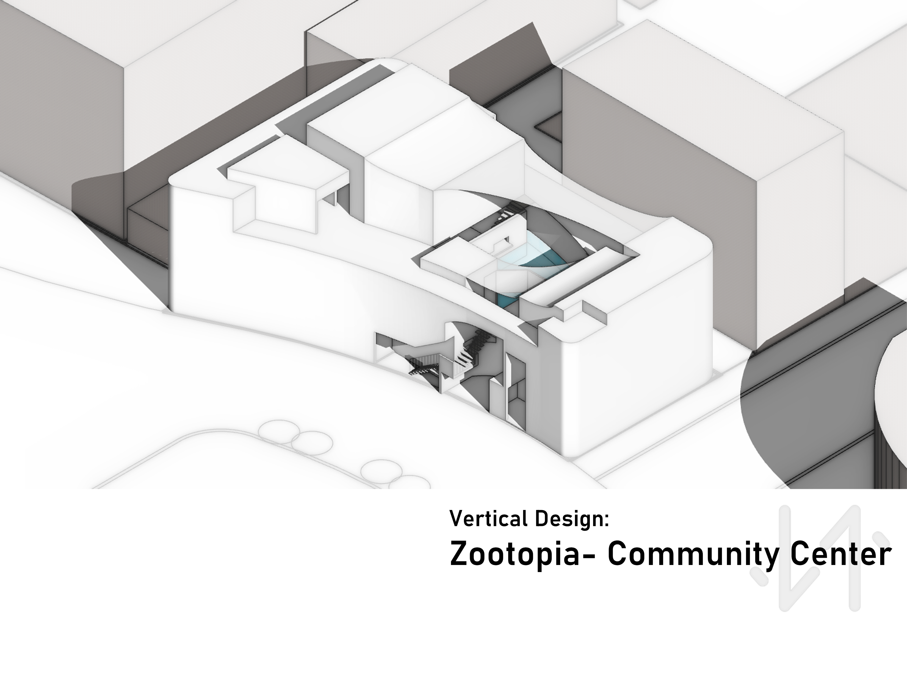
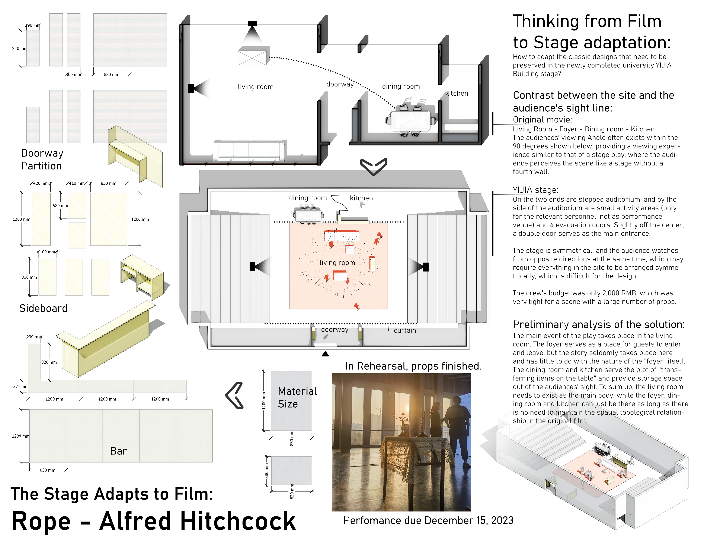

# :wave:About Me
<picture> </picture>

李雪焓，24届同济CAUP建筑学，尝试转行中。
设计/建模/渲染/游戏/python/C++ 
2024 跨专业获得世界第一电影学院AFI 与 Chapman Dodge 的 Production Design专业（影视/游戏场景概念设计）Offer
     

我为McDonald中国制作的2023年终汇报片尾↑

## 近期学习成果

Python与C++学习中.
| Leetcode Solution| Easy | Medium | Hard |
|-----------------:|-----:|-------:| ----:|
|   49 (2024-12-15)|    10|      34|     5|

> [Leetcode个人主页](https://leetcode.cn/u/dicecontractor/)

PyQt图形界面
 
 12306退改费查询程序
 
 为学习PyQT图形界面而设计的程序，可以直观展示退改费随时间变化，并指导操作策略。
 
 使用工具：PySide6

  <picture> </picture>
  <picture> </picture>

 [github源代码](https://github.com/DiceContractor/PyQt-12306)

深度学习-图像分类应用
 
为麦当劳发展部的图像分类工作训练的模型

## 2023 Portfolio for Production Design（影视/游戏场景概念设计）
本科建筑项目的概念设计化表达，依此作品集跨专业拿到2枚offer：

- 世界第一电影学院AFI- Production Design
- Chapman Dodge道奇电影学院- Production Design

 

   
   
   
   
   
   
 

 
作品集目录：

> 1. [Vertical Design: Zootopia Community Center 垂直向度设计：动物城社区中心](https://github.com/DiceContractor/DiceContractor/blob/main/Portfolio%20for%20PD%202023/1-Zootopia%20Community%20Center.pdf)
> 3. [Response to Human Environment: Ruikangli Youth Apartment 回应人居环境：瑞康里青年公寓](https://github.com/DiceContractor/DiceContractor/blob/main/Portfolio%20for%20PD%202023/2-Ruikangli%20Youth%20Apartment.pdf)
> 4. [Response to Natural Environment: Multifunctional Public Building in the Mountain 回应自然环境：山地多功能建筑](https://github.com/DiceContractor/DiceContractor/blob/main/Portfolio%20for%20PD%202023/3-Multifunctional%20Public%20Building%20in%20the%20Mountain.pdf)
> 5. [Aid for the Purpose of Game:Mole Manor Central Planning 游戏交互改进：摩尔庄园中心枢纽重规划](https://github.com/DiceContractor/DiceContractor/blob/main/Portfolio%20for%20PD%202023/4-Mole%20Manor%20Central%20Planning.pdf)
> 6. [The Stage Adapts to Film: Rope - Alfred Hitchcock 影视改编舞台策划：《绳索》希区柯克](https://github.com/DiceContractor/DiceContractor/blob/main/Portfolio%20for%20PD%202023/5-Rope.pdf)
> 7. [Other Works 手绘等其他作品](https://github.com/DiceContractor/DiceContractor/blob/main/Portfolio%20for%20PD%202023/6-Others.pdf)

